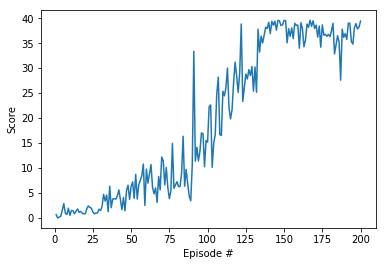

# Project 2 - Continuous Control
## Training a DeepRL agent to solve the Unity Single-Agent Reacher task

### Solution
This solution is based on the DDPG algorithm, adapted from the pendulum exercise. The agent reaches (no pun intended) an average score of 30 after **186** episodes. 
The main change I made to the original implementation was to force the initial network weights to be equal for the local and target networks after initializing them, for both actor and critic. This helped the agent start learning much faster. It was inspired by remarks made by Gregorio Mezquita, a fellow student. 
Both actor and critic networks have 2 **fully-connected hidden layers of 128 nodes**, both trained with a learning rate of **0.001**, using mini-batches of **256**, a replay buffer of **100000**, and a discount of **0.9**. The Ornstein-Uhlenbeck noise has a sigma of **0.1** and the soft update is made using a tau of **0.001**.
The training seems to be fairly stable for a RL task. The score kept on improving after the goal was reached.

---

### Next Steps
This is but a first solution and there is a number of ideas I would like to try next:
+ Run training for a much longer number of episodes and see if the average score keeps on improving or it ends up crashing.
+ Tinker some more with network architecture and hyperparameters. I suspect both actor and critic networks can be made smaller.
+ Try solving the task using PPO and compare how both algorithms perform.
+ Tackle the multi-agent case.

